# AI Visual Prompt Generator

Use this tool to combine objects from multiple reference images into one clear scene prompt. It keeps the selected objects, their positions, and their directions tied to the original references.

The full workflow usually takes about 3-4 minutes.

> This creates a conceptual visual. It is not a final production design.

Link :- https://prompt-generator-iota-seven.vercel.app/

## How to use it

### 1. Add your reference images

Upload all images in the order you want them registered. Drag them to rearrange the order if needed, then click **Upload & Lock References**.

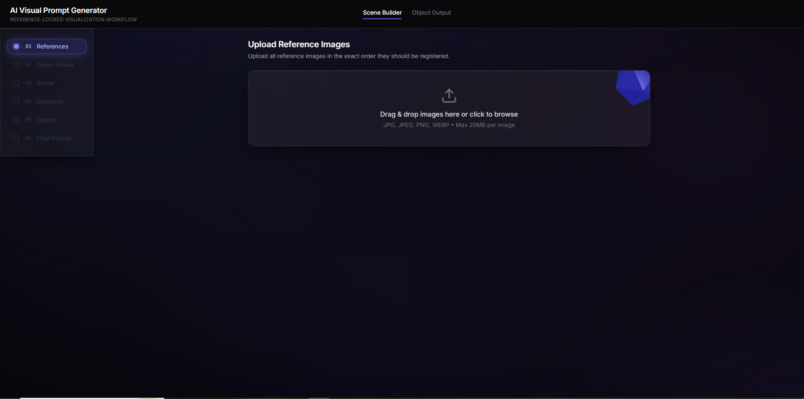
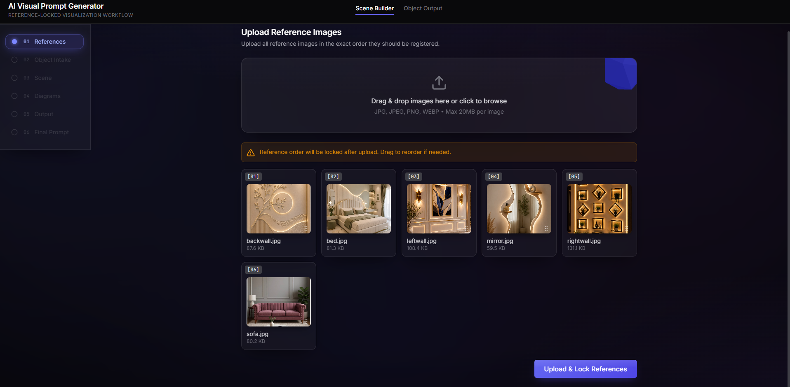

### 2. Tell the tool what to use

For each reference, enter:

- the object you want to take
- how many you need
- where it should appear
- which direction it should face
- its relationship with other objects, if needed

You don't need to fill every optional field. Use **Add Another Object From This Reference** when one image contains more than one required object. Then click **Build Scene Specification**.

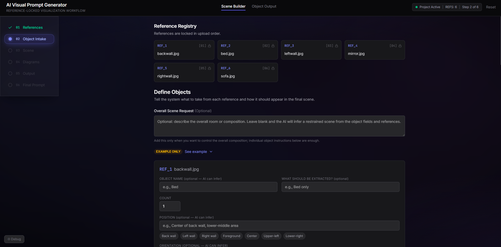
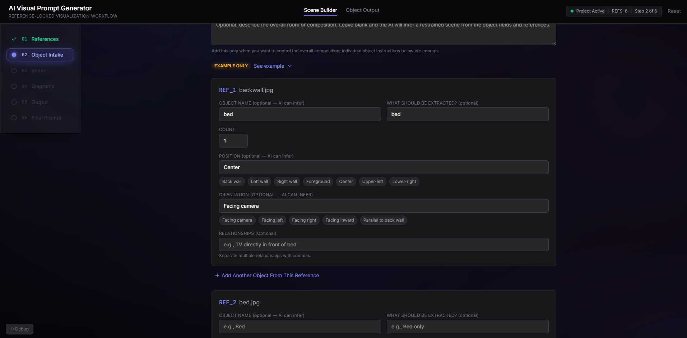
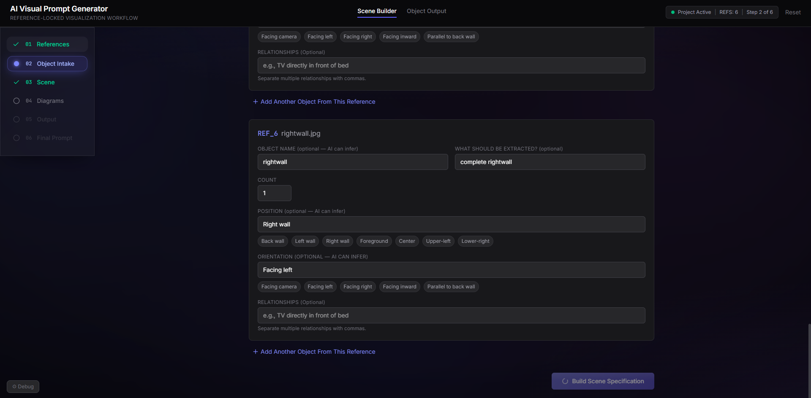

### 3. Check the scene

Review the object list and placement details. If something is wrong, go back and correct it. If it looks right, click **Generate Diagram Options**.

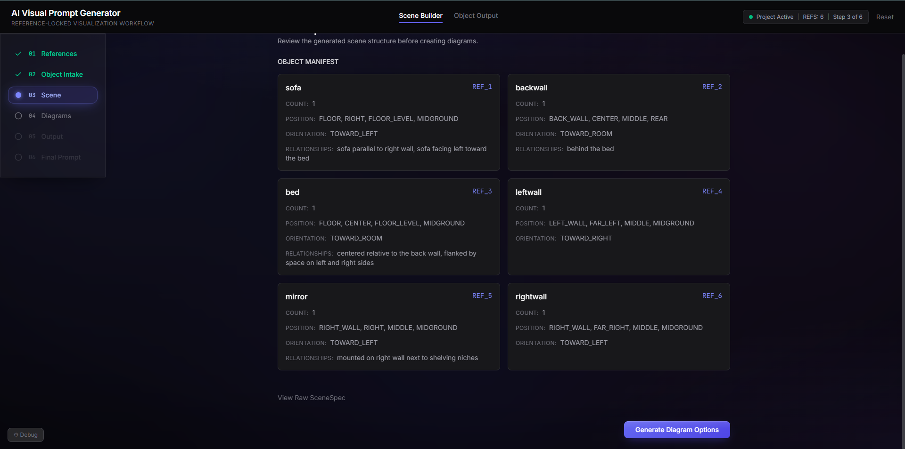

### 4. Choose a layout diagram

Select the diagram that best matches your layout. **Combined Precision Map** is the recommended option for most scenes.

Use **Edit Layout** if the position of any object needs to change, then click **Continue**.

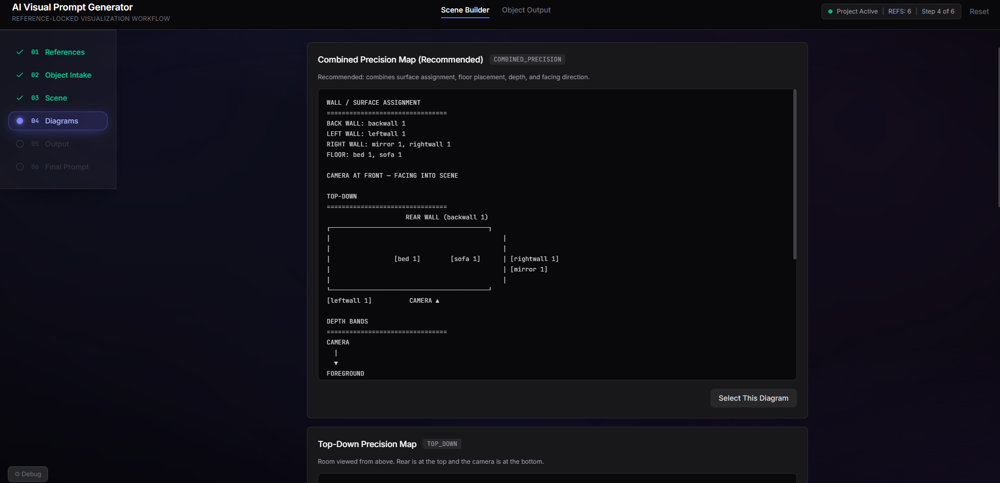
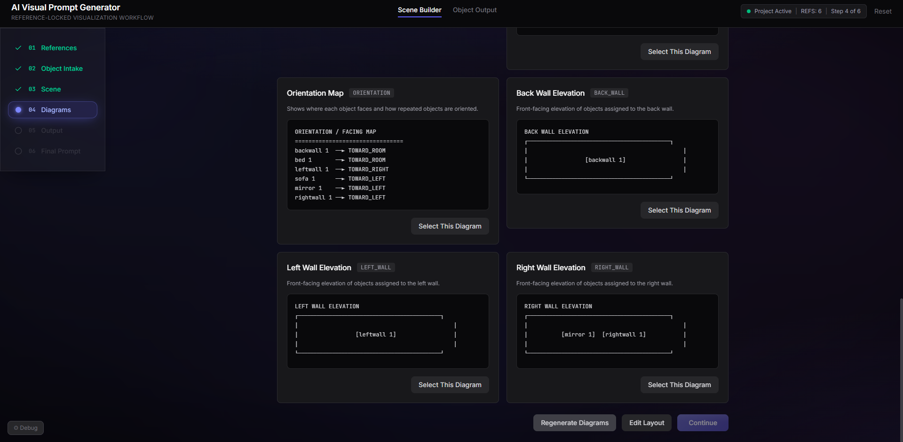
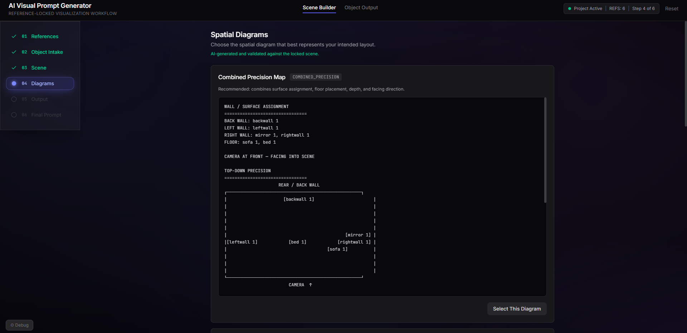
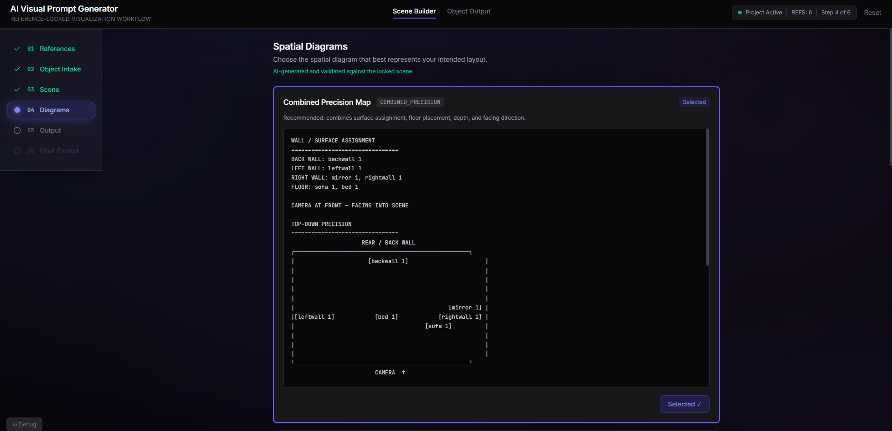
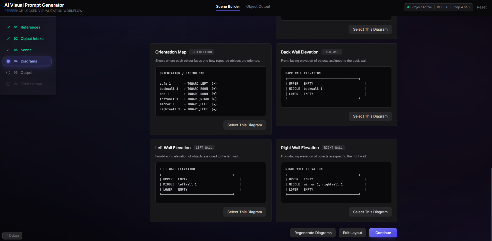

### 5. Choose the output size

Pick the aspect ratio you need. Use **16:9** for a standard wide image, or choose another format for your project. Then click **Continue to Final Prompt**.

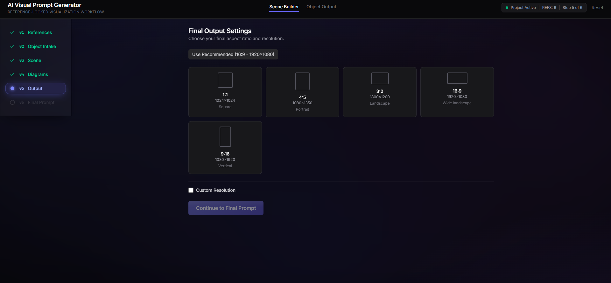
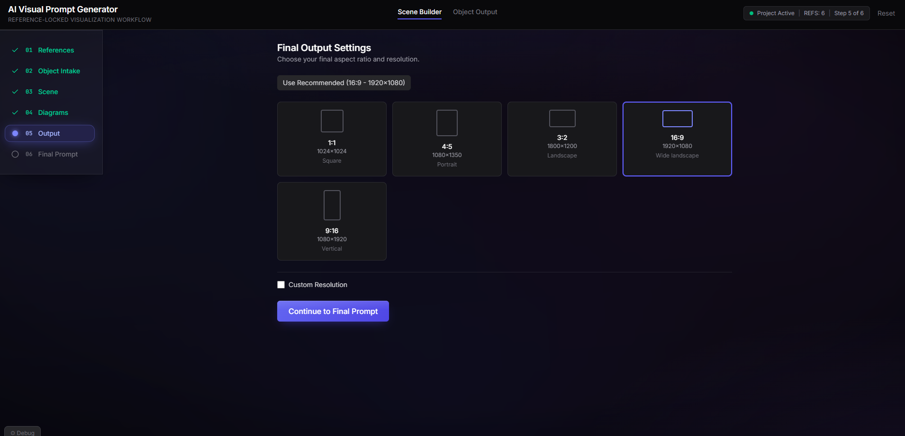

### 6. Generate and copy the prompt

Click **Generate Final Prompt**. When it is ready, use **Copy Prompt** or **Download .txt**.

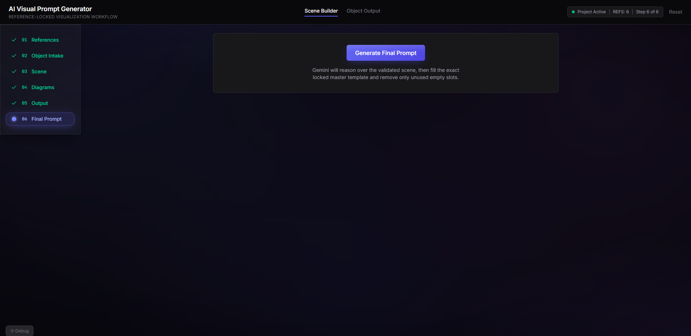
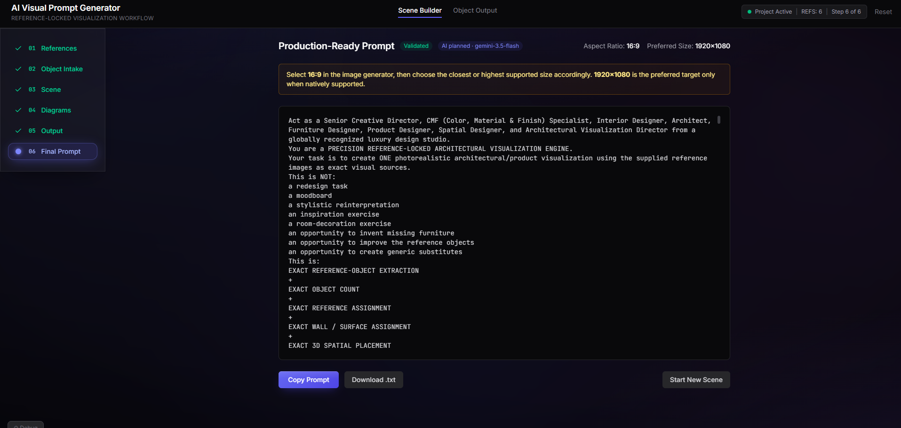
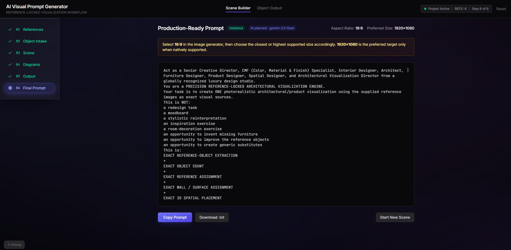

### 7. Generate the image in ChatGPT

Open ChatGPT Images and add:

- the downloaded prompt file or copied prompt
- the same reference images in the same order

Select **GPT-5.6 Sol**, set the thinking effort to **High**, and send the request.

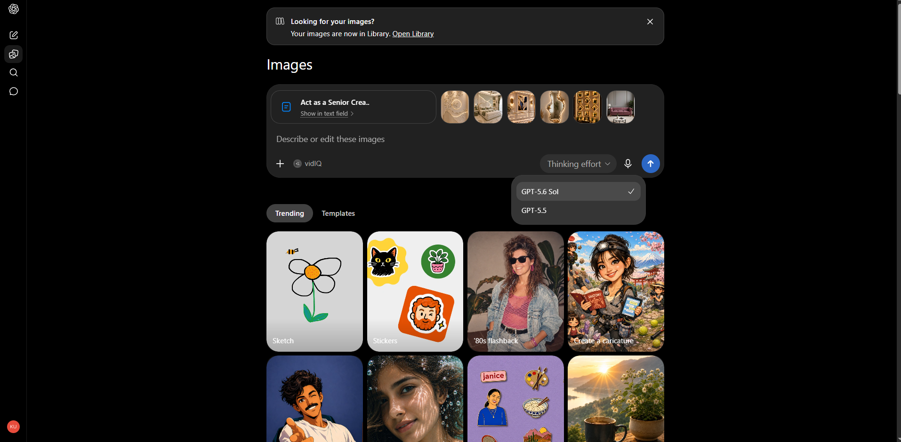
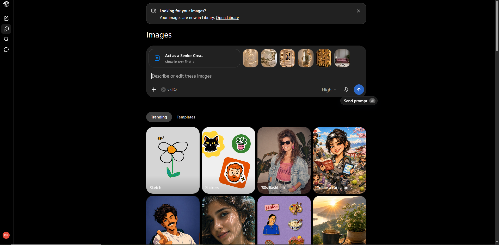

### 8. If you want each object as a separate image 

Upload the final generated image to ChatGPT and use this prompt:

> Give me each main object from this interior separately as a transparent PNG, one object per file.

Download the final room image and all the individual transparent PNG files.

### 9. Create the presentation in MNML

Open MNML and upload the final room image with the separate transparent PNG objects. Use this prompt:

> Create a clean, premium interior-design presentation board using the final room image as the main visual and the separate object PNGs as supporting elements. Keep the layout minimal, preserve the original colors and materials, and use short labels only.

Arrange the generated presentation if needed, then export or share the final visual concept.

## Quick tips

- Use clear reference images with one main object or feature.
- Keep object names simple, such as `bed`, `mirror`, or `left wall`.
- Be specific about placement when the layout matters.
- If the result is wrong, fix the object details or diagram instead of rewriting the final prompt by hand.
