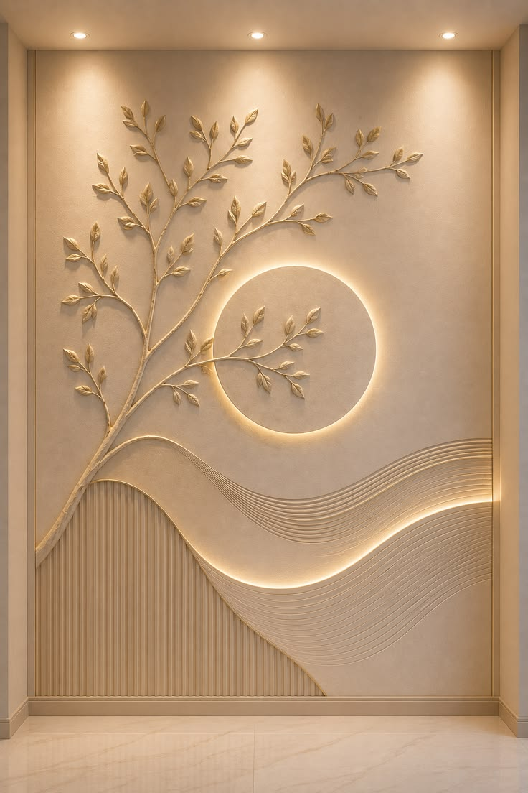
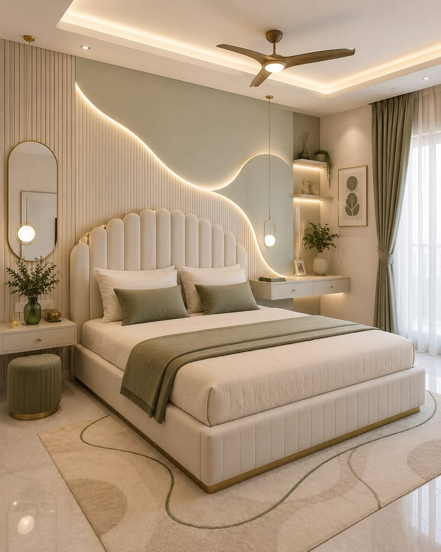
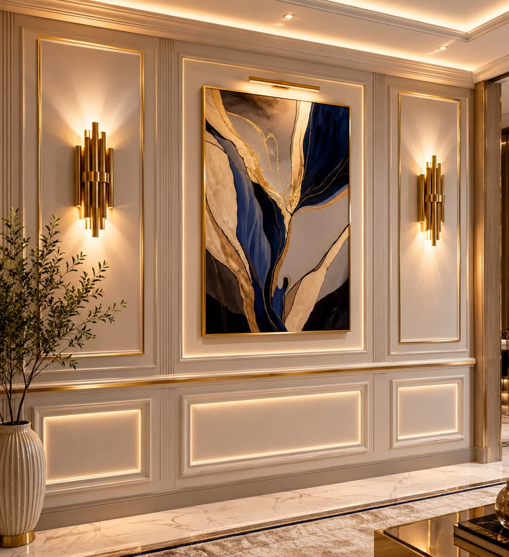
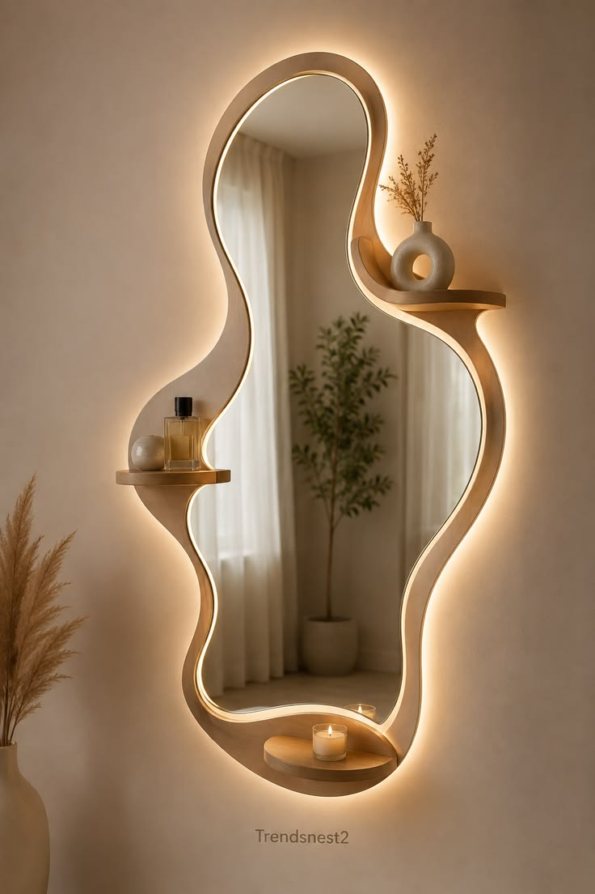
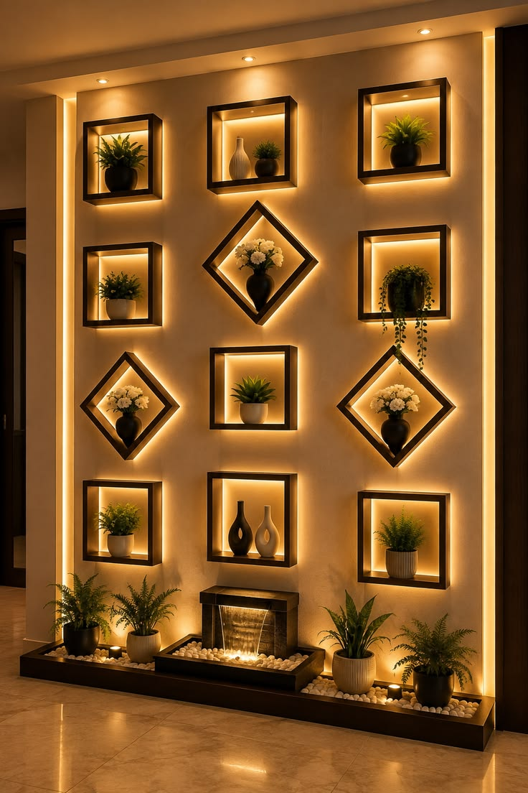
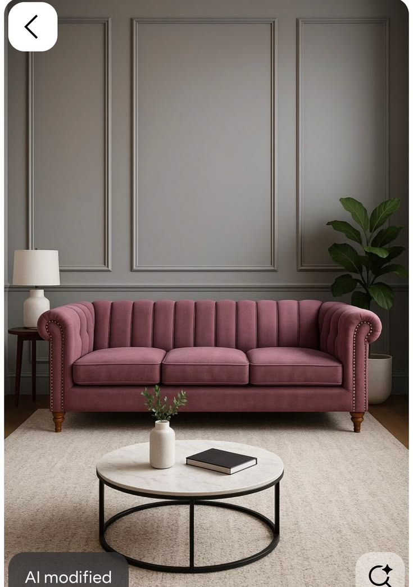
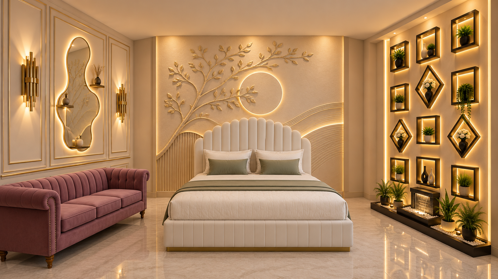
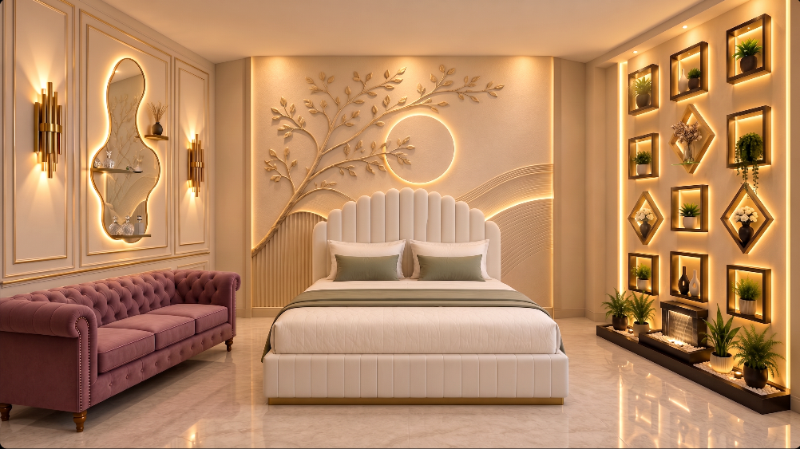

# Bedroom Example

This case study combines six references into one wide bedroom concept. It demonstrates how to separate object extraction from layout instructions.

## Reference set

| Reference | Required content |
| --- | --- |
|  | Complete sculptural back-wall feature |
|  | Bed, bedding, pillows, and throw only |
|  | Complete panelled left wall with both sconces; central artwork excluded |
|  | Illuminated organic mirror with its integrated shelves |
|  | Complete illuminated niche installation and lower planter/fountain base |
|  | Sofa only |

## Overall scene request

> Create a wide, front-facing luxury bedroom. Place the bed in the center against the sculptural back wall. Use the complete panelled wall on the left with the organic mirror inside its central panel, the complete illuminated display wall on the right, and the mauve sofa in the front-left area. Keep the reference materials, proportions, and warm lighting recognizable.

## Object entries

### Back-wall feature

| Field | Value |
| --- | --- |
| Object name | Sculptural back wall |
| Extract | Complete wall feature, including botanical relief, circular halo, fluted lower section, flowing bands, and integrated lighting |
| Count | 1 |
| Position | Full back wall, centered, rear of scene |
| Orientation | Facing camera, parallel to the bed |
| Relationship | Directly behind the bed |

### Bed

| Field | Value |
| --- | --- |
| Object name | Upholstered bed |
| Extract | Bed only, including scalloped headboard, frame, bedding, pillows, sage cushions, throw, and gold plinth; exclude the room, wall, rug, side furniture, and decor |
| Count | 1 |
| Position | Centered against the back wall, floor level, rear midground |
| Orientation | Facing camera, parallel to the back wall |
| Relationship | Directly in front of the sculptural back wall |

### Left wall

| Field | Value |
| --- | --- |
| Object name | Panelled left wall |
| Extract | Complete cream moulded wall with gold trim and both sconces; exclude the central artwork and plant |
| Count | 1 |
| Position | Full left wall |
| Orientation | Mounted as the left wall, facing right into the room |
| Relationship | Contains the organic mirror in its central panel; sofa positioned in front |

### Organic mirror

| Field | Value |
| --- | --- |
| Object name | Organic illuminated mirror |
| Extract | Mirror only, including the irregular frame, warm backlight, integrated shelves, and small shelf accessories; exclude surrounding wall and floor decor |
| Count | 1 |
| Position | Center of the panelled left wall, between the sconces |
| Orientation | Mounted flush on the left wall, facing into the room |
| Relationship | Replaces the central artwork in the left-wall reference |

### Right wall

| Field | Value |
| --- | --- |
| Object name | Illuminated display wall |
| Extract | Complete display-wall installation, including square and diamond niches, plants, vases, backlighting, vertical edge lights, fountain, stones, and lower planter base |
| Count | 1 |
| Position | Full right wall |
| Orientation | Mounted as the right wall, facing left into the room |
| Relationship | Runs along the right side of the bed without moving behind it |

### Sofa

| Field | Value |
| --- | --- |
| Object name | Mauve sofa |
| Extract | Sofa only, including channel upholstery, rolled arms, nailhead trim, cushions, and wooden legs; exclude wall, lamp, plant, rug, table, and app controls |
| Count | 1 |
| Position | Front-left area, along the left wall, floor level |
| Orientation | Facing inward toward the center of the room, slightly toward camera |
| Relationship | In front of the left wall and clear of the bed |

## Diagram and output

Choose **Combined Precision Map** and confirm that the bed is centered, the mirror is assigned to the left wall, the sofa occupies the front-left area, and the display installation remains on the right wall.

Use `16:9` for the wide composition. The preferred size is `1920x1080`.

## Generated result

The main layout is preserved: the bed anchors the center, both side walls remain visible, the sofa occupies the left side, and the illuminated installation occupies the right side. Small decorative details may vary between generations.

## Refined result

The mnml.ai pass improves surface finish and visual consistency. It should be treated as a refinement step; compare it with the first output to catch any changed furniture detail or wall ornament before use.
